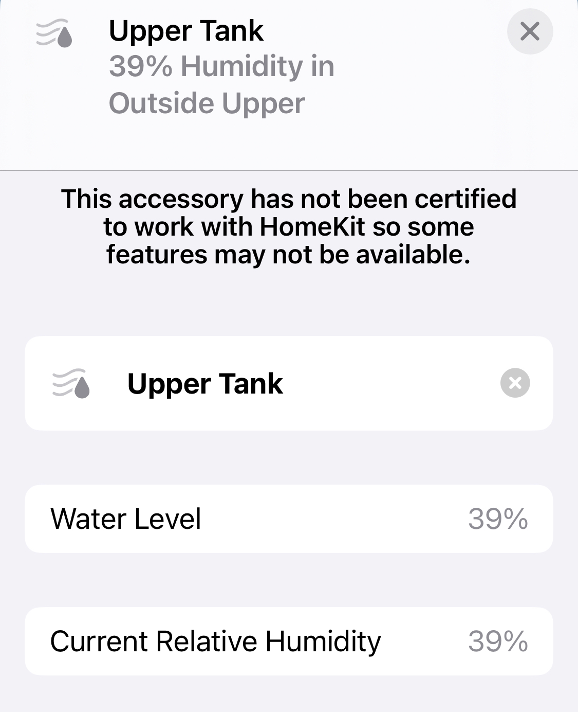

# Homebridge Plugin for PTLevel water level sensors

Plugin for PTLevel water level sensors from [Parem Tech](https://paremtech.com)

## Configuration
Paremtech offers several different [API options](https://support.paremtech.com/portal/en/kb/articles/api-options)

This plugin supports the following

- [ ] REST API 
- [ ] Token API
- [x] Public share API
- [x] Direct to Device API

In most cases you will probably want to use the Direct to Device API to keep all communications local and not require internet or cloud access.

Using the public API only requires that you enter the Sensor ID.  Refer to the [documentation](https://support.paremtech.com/portal/en/kb/articles/api-options#Public_Share_API) for help finding the Sensor ID.

If using the Direct to Device API, can only read the raw ADC value.  To configure a local device you will need to give it a Name, IP Address and Calibration factor in order to convert the ADC value to a percent full.

## HomeKit integration
Unfortunately HomeKit does not have a water tank device.  Only Humidifies support a water level characteristic.  This plugn will expose the sensor as a Humidity Sensor and will also report a water level characteristic.  I chose to use a humidity sensor because HomeKit will allow you to setup actions based on Humidity Values.

